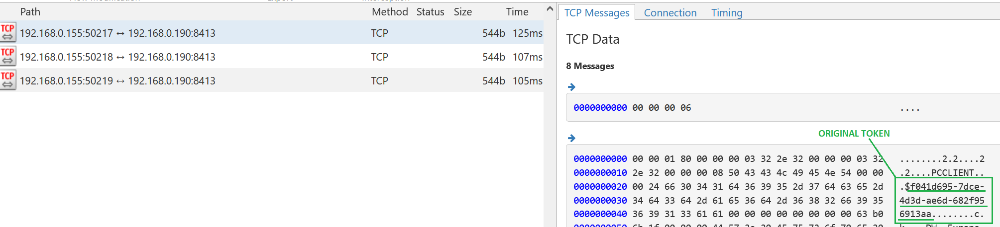
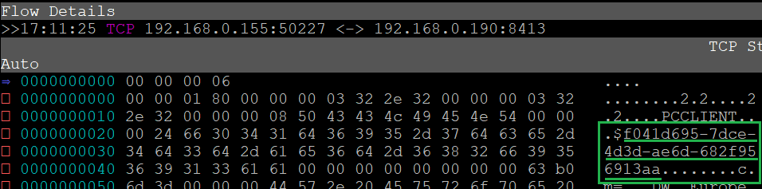
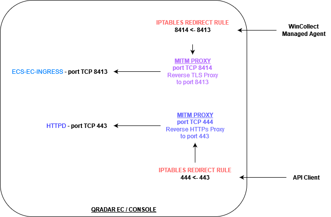

# QRadar-inspect-tls
Inspect QRadar encrypted traffic with mitmproxy. This allows to see WinCollect or SEC Tokens in cleartext.

This repo contains instructions on how to configure [mitmproxy](https://mitmproxy.org/) on QRadar hosts (EC or Console) to eavesdrop encrypted traffic coming from https/tls clients, for example managed WinCollect agents connecting to SysLog-TLS server (port 8413) or Console on port 443.

Some script are also provided to easily extract WinCollect/SEC tokens.


## TL;DR - What can I achieve with these instructions?
For the impatient, here are some screenshots of the results:





## Interception Topology
We are using iptables rules in the **NAT PREROUTING** chain to divert incoming traffic to pass through mitmproxy.
\
Affected clients can be limited with proper iptables filters.




## mitmproxy Installation
To keep QRadar environment clean, we will install mitmproxy as a chroot environment, taken from latest docker image.
\
See [mitm-docker-chroot.md](./mitm-docker-chroot.md) for instructions

As an alternative, you can install it as a python virtual env.
\
See [mitm-venv.md](./mitm-venv.md) for some directions (not really tested - this guide will rely on chroot method).


## Certificates preparation

### Prepare certificate for HTTPs (Console):
\
Check https certificate is correct (sha signatures must match):

    openssl rsa -inform der -in /etc/httpd/conf/certs/cert.key -outform pem | openssl rsa -noout -modulus | openssl sha
    openssl x509 -noout -modulus -in /etc/httpd/conf/certs/cert.cert | openssl sha

Then create the certificate in mitmproxy format:

    openssl rsa -inform der -in /etc/httpd/conf/certs/cert.key -outform pem | cat - /etc/httpd/conf/certs/cert.cert > ~/mitmproxy/https.pem


### Prepare certificate for TLS Syslog (WinCollect managed agents):
\
Check certificate is correct (sha signatures must match):

    openssl x509 -noout -modulus -in /opt/qradar/conf/trusted_certificates/syslog-tls.cert | openssl sha
    openssl rsa -noout -modulus -in /opt/qradar/conf/trusted_certificates/syslog-tls.key | openssl sha

Then create the certificate in mitmproxy format:

    cat /opt/qradar/conf/trusted_certificates/syslog-tls.key /opt/qradar/conf/trusted_certificates/syslog-tls.cert > ~/mitmproxy/syslog-tls.pem


## Global Configuration Variables
Here we will set some bash variables to more easily configure the environment and run the commands.
\
`QRADAR_IP` is the IP address of the receiving interface (depending on the protocol and configuration used).
\
`IPTABLES_DIVERT_CONDITION` is the iptables filter condition that can be used to precisely identify the clients that will be diverted.


    QRADAR_IP=192.168.0.190
    IPTABLES_DIVERT_CONDITION="-i ens33 ! -s ${QRADAR_IP}"
    MITMWEBHOST=${QRADAR_IP}
    MITMWEBPORT=8081
    MITM_PORT_WCOLLECTCFG=8414
    MITM_PORT_HTTPS=444


## MITMWEB - mitmproxy web interface
MITMWEB is a web interface for mitmproxy and will listen on port `MITMWEBPORT` of IP `MITMWEBHOST`
\
It is optional (we can either use mitmweb or mitmproxy or mitmdump, depending on our needs).

#### MITMWEB WEB INTERFACE IPTABLES RULE:
To be able to connect to its web interface, we need to allow its port in iptables `INPUT` chain:

    [[ $MITMWEBPORT -gt 0 ]] && echo inserting iptables ACCEPT rule for MITM WEB port && iptables -I INPUT -p tcp --dport ${MITMWEBPORT} -j ACCEPT

*Inspect the resulting iptables rules and note rule has been inserted at position n. 1:*
```
iptables -n -L INPUT -v --line-numbers
Chain INPUT (policy ACCEPT 364 packets, 13104 bytes)
num   pkts bytes target     prot opt in     out     source               destination
1        0     0 ACCEPT     tcp  --  *      *       0.0.0.0/0            0.0.0.0/0            tcp dpt:8081
2    13292 1624K ACCEPT     tcp  --  *      *       0.0.0.0/0            0.0.0.0/0            tcp dpt:8413
3        0     0 ACCEPT     tcp  --  *      *       0.0.0.0/0            0.0.0.0/0            tcp dpt:9381
4      77M   50G QChain     all  --  *      *       0.0.0.0/0            0.0.0.0/0
5        0     0 REJECT     tcp  --  *      *       0.0.0.0/0            0.0.0.0/0            tcp dpt:8001 reject-with icmp-port-unreachable
6        0     0 REJECT     udp  --  *      *       0.0.0.0/0            0.0.0.0/0            udp dpt:8001 reject-with icmp-port-unreachable
```

#### To later rollback IPTABLES rule for MITMWEB web interface:
    IPTRULE_TO_DELETE=$(iptables -n -L INPUT -v --line-numbers | grep -e "dpt:${MITMWEBPORT}$" | cut -d' ' -f1) ; IPTRULE_TO_DELETE=( $IPTRULE_TO_DELETE ) ; IPTRULE_TO_DELETE=${IPTRULE_TO_DELETE[0]} ; echo IPTRULE_TO_DELETE=$IPTRULE_TO_DELETE
    [[ $IPTRULE_TO_DELETE -ge 1 ]] && echo removing iptable rule && iptables -D INPUT $IPTRULE_TO_DELETE ; unset IPTRULE_TO_DELETE


## WinCollect Tokens Interception (SysLog-TLS traffic)

The mitm server will receive tcp/TLS traffic thanks to the diverting iptables rule that will be installed later.
\
It will be listening to a dedicated port, for which we need an iptables rule for the `INPUT` chain:

    [[ $MITM_PORT_WCOLLECTCFG -gt 0 ]] && echo inserting iptables ACCEPT rule for MITM port && iptables -I INPUT -p tcp --dport ${MITM_PORT_WCOLLECTCFG} -j ACCEPT


*Inspect the resulting iptables rules and note rule has been has been inserted at position n. 1:*
```
iptables -n -L INPUT -v --line-numbers
Chain INPUT (policy ACCEPT 0 packets, 0 bytes)
num   pkts bytes target     prot opt in     out     source               destination
1        0     0 ACCEPT     tcp  --  *      *       0.0.0.0/0            0.0.0.0/0            tcp dpt:8414
```

#### To later rollback IPTABLES rule for MITM SysLog-TLS traffic:

    IPTRULE_TO_DELETE=$(iptables -n -L INPUT -v --line-numbers | grep -e "dpt:${MITM_PORT_WCOLLECTCFG}$" | cut -d' ' -f1) ; IPTRULE_TO_DELETE=( $IPTRULE_TO_DELETE ) ; IPTRULE_TO_DELETE=${IPTRULE_TO_DELETE[0]} ; echo IPTRULE_TO_DELETE=$IPTRULE_TO_DELETE
    [[ $IPTRULE_TO_DELETE -ge 1 ]] && echo removing iptable rule && iptables -D INPUT $IPTRULE_TO_DELETE ; unset IPTRULE_TO_DELETE

\
Now we can run the mitm server in a dedicated screen console.
\
\
*Note*: We must run only **ONE** of them (either mitmweb *-or-* mitmproxy *-or-* mitmdump).


#### WinCollect mitm listener - with mitmweb

    [[ $MITMWEBPORT -gt 0 ]] && [[ $MITM_PORT_WCOLLECTCFG -gt 0 ]] && screen chroot ~/mitmproxy mitmweb --no-web-open-browser --web-port ${MITMWEBPORT} --web-host ${MITMWEBHOST} --ssl-insecure --certs /syslog-tls.pem --set websocket=false --set onboarding=false --no-http2 --mode reverse:tls://${QRADAR_IP}:8413@${QRADAR_IP}:${MITM_PORT_WCOLLECTCFG}


#### WinCollect mitm listener - with mitmproxy

    [[ $MITM_PORT_WCOLLECTCFG -gt 0 ]] && screen chroot ~/mitmproxy mitmproxy --ssl-insecure --certs /syslog-tls.pem --set websocket=false --set onboarding=false --no-http2 --mode reverse:tls://${QRADAR_IP}:8413@${QRADAR_IP}:${MITM_PORT_WCOLLECTCFG}


#### WinCollect mitm listener - with mitmdump (with optional [script to dump tokens](./dump_wcollect_tokens.py) )

    [[ $MITM_PORT_WCOLLECTCFG -gt 0 ]] && screen chroot /root/mitmproxy mitmdump  --ssl-insecure --certs /cert.pem --set websocket=false --set onboarding=false --no-http2 --mode reverse:tls://${QRADAR_IP}:8413@${QRADAR_IP}:${MITM_PORT} -s dump_wcollect_tokens.py


Lastly, we install an iptables `REDIRECT` rule to divert incoming traffic to mitm server and thus activate the interception.
\
*Note*: You can customize `IPTABLES_DIVERT_CONDITION` bash variable with a proper iptables filter logic that suits your environment.

    [[ $MITM_PORT_WCOLLECTCFG -gt 0 ]] && echo inserting iptables REDIRECT rule && iptables -t nat -I PREROUTING ${IPTABLES_DIVERT_CONDITION} -p tcp --dport 8413 -j REDIRECT --to-port ${MITM_PORT_WCOLLECTCFG}

*Inspect the `NAT/PREROUTING` table and note rule has been has been inserted at position n. 1:*
```
iptables -n -L PREROUTING -t nat -v --line-numbers
Chain PREROUTING (policy ACCEPT 7 packets, 396 bytes)
num   pkts bytes target     prot opt in     out     source               destination
1        0     0 REDIRECT   tcp  --  ens33  *      !192.168.0.190        0.0.0.0/0            tcp dpt:8413 redir ports 8414
2     551K   33M DOCKER     all  --  *      *       0.0.0.0/0            0.0.0.0/0            ADDRTYPE match dst-type LOCAL
```


#### To later rollback IPTABLES REDIRECT rule for MITM SysLog-TLS traffic:
    IPTRULE_TO_DELETE=$(iptables -n -t nat -L PREROUTING -v --line-numbers | grep -e ".* REDIRECT .*tcp dpt:8413 redir ports ${MITM_PORT_WCOLLECTCFG}$" | cut -d' ' -f1) ; IPTRULE_TO_DELETE=( $IPTRULE_TO_DELETE ) ; IPTRULE_TO_DELETE=${IPTRULE_TO_DELETE[0]} ; echo IPTRULE_TO_DELETE=$IPTRULE_TO_DELETE
    [[ $IPTRULE_TO_DELETE -ge 1 ]] && echo removing iptable rule && iptables -t nat -D PREROUTING $IPTRULE_TO_DELETE ; unset IPTRULE_TO_DELETE


## Console Interception (HTTPs traffic)

The mitm server will receive HTTPs traffic thanks to the diverting iptables rule that will be installed later.
\
It will be listening to a dedicated port, for which we need an iptables rule for the `INPUT` chain:


    [[ $MITM_PORT_HTTPS -gt 0 ]] && echo inserting iptables ACCEPT rule for MITM port && iptables -I INPUT -p tcp --dport ${MITM_PORT_HTTPS} -j ACCEPT

*Inspect the resulting iptables rules and note rule has been has been inserted at position n. 1:*
```
iptables -n -L INPUT -v --line-numbers
Chain INPUT (policy ACCEPT 60 packets, 2160 bytes)
num   pkts bytes target     prot opt in     out     source               destination
1        0     0 ACCEPT     tcp  --  *      *       0.0.0.0/0            0.0.0.0/0            tcp dpt:444
```

#### To later rollback IPTABLES rule for HTTPs traffic:

    IPTRULE_TO_DELETE=$(iptables -n -L INPUT -v --line-numbers | grep -e "dpt:${MITM_PORT_HTTPS}$" | cut -d' ' -f1) ; IPTRULE_TO_DELETE=( $IPTRULE_TO_DELETE ) ; IPTRULE_TO_DELETE=${IPTRULE_TO_DELETE[0]} ; echo IPTRULE_TO_DELETE=$IPTRULE_TO_DELETE
    [[ $IPTRULE_TO_DELETE -ge 1 ]] && echo removing iptable rule && iptables -D INPUT $IPTRULE_TO_DELETE ; unset IPTRULE_TO_DELETE

----------------------------------------------

\
Now we can run the mitm server in a dedicated screen console.
\
\
*Note*: We must run only **ONE** of them (either mitmweb *-or-* mitmproxy *-or-* mitmdump).


#### Console HTTPs mitm listener - with mitmweb

    [[ $MITMWEBPORT -gt 0 ]] && [[ $MITM_PORT_HTTPS -gt 0 ]] && screen chroot ~/mitmproxy mitmweb --no-web-open-browser --web-port ${MITMWEBPORT} --web-host ${MITMWEBHOST} --ssl-insecure --certs /https.pem --set websocket=false --set onboarding=false --mode reverse:https://${QRADAR_IP}:443@${QRADAR_IP}:${MITM_PORT_HTTPS}


#### Console HTTPs mitm listener - with mitmproxy

    [[ $MITM_PORT_HTTPS -gt 0 ]] && screen chroot ~/mitmproxy mitmproxy --ssl-insecure --certs /https.pem --set websocket=false --set onboarding=false --mode reverse:https://${QRADAR_IP}:443@${QRADAR_IP}:${MITM_PORT_HTTPS}


#### Console HTTPs mitm listener - with mitmdump (with optional [script to dump SEC tokens](./dump_sec_tokens.py) )

    [[ $MITM_PORT_WCOLLECTCFG -gt 0 ]] && screen chroot /root/mitmproxy mitmdump --ssl-insecure --certs /https.pem --set websocket=false --set onboarding=false --set flow_detail=3 --mode reverse:https://${QRADAR_IP}:443@${QRADAR_IP}:${MITM_PORT_HTTPS} -s dump_sec_tokens.py "~hq SEC:.*[a-z0-9]{8}-[a-z0-9]{4}-[a-z0-9]{4}-[a-z0-9]{4}-[a-z0-9]{12}"

*Note:* `flow_detail=3` will output request/response on console. Try removing it for neater output.


Lastly, we install an iptables `REDIRECT` rule to divert incoming traffic to mitm server and thus activate the interception.
\
*Note*: You can customize `IPTABLES_DIVERT_CONDITION` bash variable with a proper iptables filter logic that suits your environment.

    [[ $MITM_PORT_HTTPS -gt 0 ]] && echo inserting iptables REDIRECT rule && iptables -t nat -I PREROUTING ${IPTABLES_DIVERT_CONDITION} -p tcp --dport 443 -j REDIRECT --to-port ${MITM_PORT_HTTPS}

   
*Inspect the `NAT/PREROUTING` table and note rule has been has been inserted at position n. 1:*
```
iptables -n -L PREROUTING -t nat -v --line-numbers
Chain PREROUTING (policy ACCEPT 7 packets, 396 bytes)
num   pkts bytes target     prot opt in     out     source               destination
1        0     0 REDIRECT   tcp  --  ens33  *      !192.168.0.190        0.0.0.0/0            tcp dpt:443 redir ports 444
2     551K   33M DOCKER     all  --  *      *       0.0.0.0/0            0.0.0.0/0            ADDRTYPE match dst-type LOCAL
```


#### To later rollback IPTABLES REDIRECT rule for Console HTTPs traffic:
    IPTRULE_TO_DELETE=$(iptables -n -t nat -L PREROUTING -v --line-numbers | grep -e ".* REDIRECT .*tcp dpt:443 redir ports ${MITM_PORT_HTTPS}$" | cut -d' ' -f1) ; IPTRULE_TO_DELETE=( $IPTRULE_TO_DELETE ) ; IPTRULE_TO_DELETE=${IPTRULE_TO_DELETE[0]} ; echo IPTRULE_TO_DELETE=$IPTRULE_TO_DELETE
    [[ $IPTRULE_TO_DELETE -ge 1 ]] && echo removing iptable rule && iptables -t nat -D PREROUTING $IPTRULE_TO_DELETE ; unset IPTRULE_TO_DELETE


